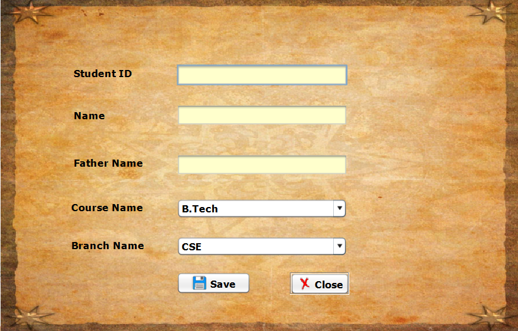
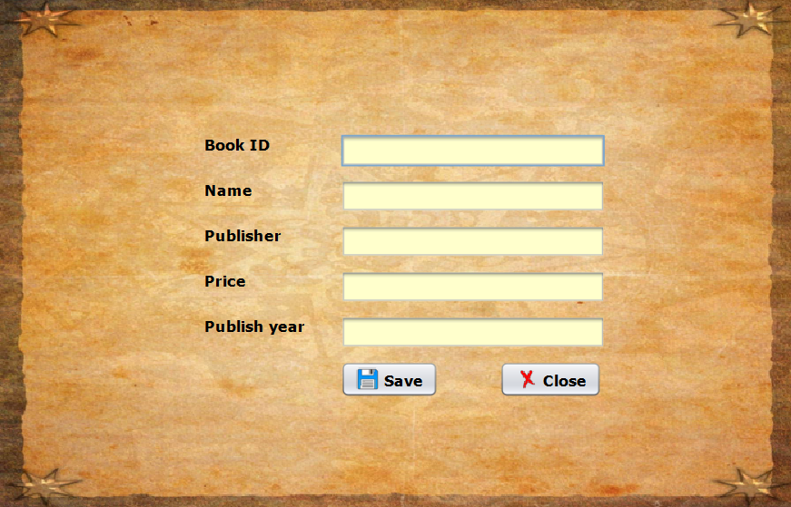
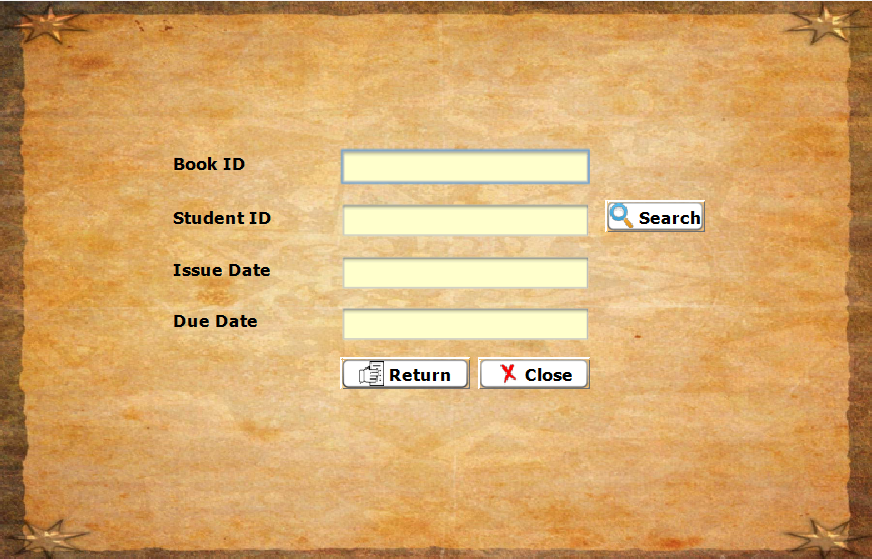
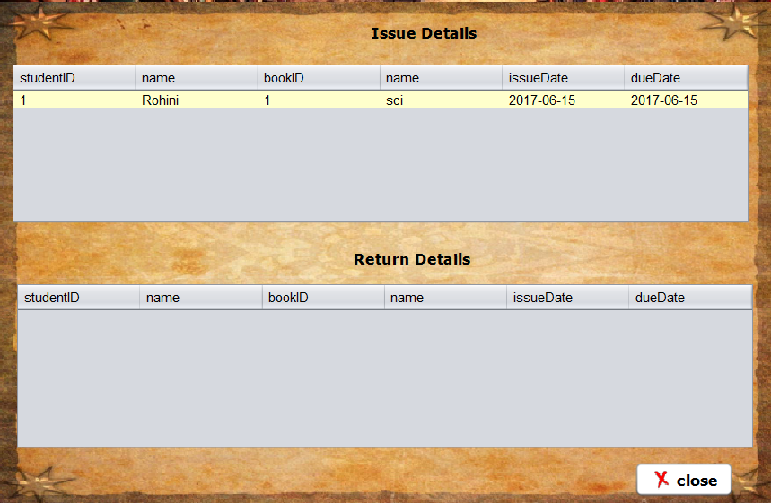

# Library Management System 

 used JAVA SWING (JFRAMES to design GUI).
 
 for backEnd , java is used with implementations of OOPS Concepts 
 
 this project is about library management in modern libraries includes -->

##  LOGIN PAGE 

 
 

##  HOME PAGE

 
 

##  NEW STUDENT PAGE

 
 

##  NEW BOOK PAGE

 
 

##  RETURN BOOK PAGE

 
 

##  STATISTICS PAGE

 
 

